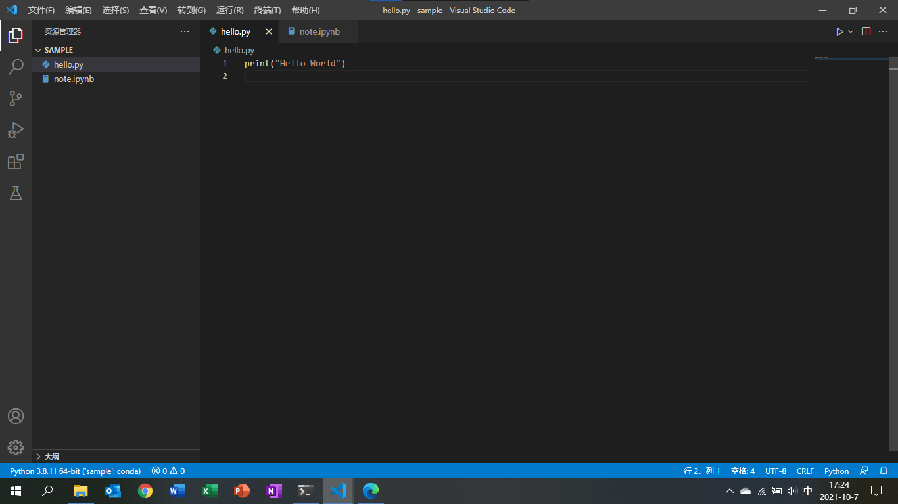
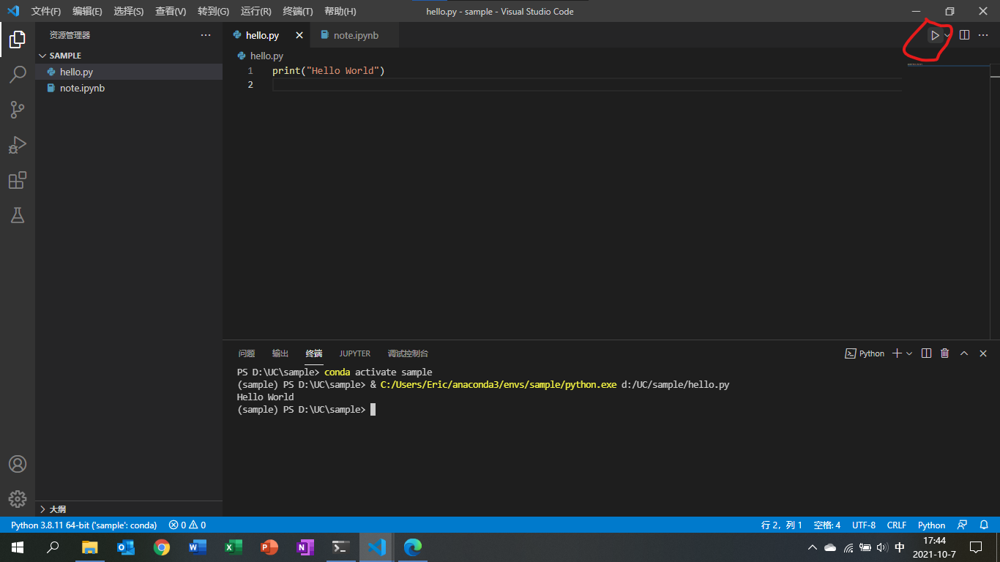
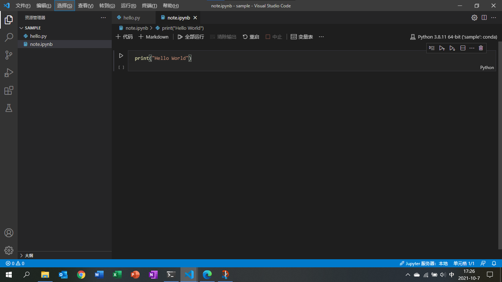

:toc: left
:toclevels: 4
:toc-title: 目录
:icons: font

= Python

== 准备

开始 Python 的学习与实践之前，我们将从 Anaconda、Terminal、VS Code 三方面着手准备，需要依序完成本节所列操作。

****
[horizontal]
Anaconda:: 管理 Python 包；隔离 Python 的开发与运行环境。
Terminal:: 以命令行方式执行 Anaconda 及 Python 开发、测试、运行相关操作。
VS Code:: 微软的 Visual Studio Code ，一款优秀的文本编辑器。结合丰富的扩展，可高效支撑多种编程语言的开发工作。
****

[IMPORTANT]
====
* 相关软件通过 winget 工具安装，需要 Windows 10 版本 1809 (10.0.17763) 或更高版本的 Windows 10、Windows 11。
* https://docs.microsoft.com/zh-cn/windows/package-manager/winget/[winget概述及指令说明]。
====

=== 安装 Windows Terminal

1、右击“Windows 徽标”，打开 Windows PowerShell 。::

2、搜索 Windows Terminal 。::

[source, Windows PowerShell]
----
winget search "Windows Terminal"
----

.返回结果
----
名称                      ID                               版本        源
------------------------------------------------------------------------------
Windows Terminal         9N0DX20HK701                     Unknown     msstore
Windows Terminal Preview 9N8G5RFZ9XK3                     Unknown     msstore
Windows Terminal         Microsoft.WindowsTerminal        1.10.2383.0 winget
Windows Terminal Preview Microsoft.WindowsTerminalPreview 1.11.2421.0 winget
----

3、安装 Windows Terminal 。:: 

[source, Windows PowerShell]
----
winget install --id Microsoft.WindowsTerminal -e
----

[CAUTION]
由于重名，安装时尽量用 id 的方式，并添加 -e 命令选项。

4、安装完成后关闭 Windows PowerShell 。::

[TIP]
====
* 安装完成后从所有应用中找到 Windows Terminal ，固定到“开始”屏幕及任务栏，方便后续使用。
* 后续操作都从 Windows Terminal 进入。
====

=== 安装 PowerShell

1、打开 Windows Terminal 。:: 

2、搜索 PowerShell 。:: 

[source, Windows PowerShell]
----
winget search Microsoft.PowerShell
----

.返回结果
----
名称                ID                           版本     源
----------------------------------------------------------------
PowerShell         Microsoft.PowerShell         7.1.4.0  winget
Powershell Preview Microsoft.PowerShell.Preview 7.2.0.10 winget
----

3、安装 PowerShell 。:: 

[source, Windows PowerShell]
----
winget install --id Microsoft.PowerShell -e
----

4、安装完成后关闭 Windows Terminal 。::

[TIP]
PowerShell 功能强于 Windows PowerShell ，建议配置 PowerShell 作为默认配置文件。

=== 安装 Anaconda

1、打开 Windows Terminal 。:: 

2、搜索 Anaconda3 。:: 

[source, PowerShell]
----
winget search Anaconda3
----

.返回结果
----
名称       ID                 版本    源
--------------------------------------------
Anaconda3 Anaconda.Anaconda3 2021.05 winget
----

3、安装 Anaconda 。:: 

[source, PowerShell]
----
winget install --name Anaconda3
----

[CAUTION]
由于搜索 Anaconda3 返回结果只有一个，安装时可用以上的简化方式。

=== 配置 Anaconda 终端

1、Windows Terminal 下拉菜单选择“设置”，打开设置窗格。:: 

2、 添加配置文件。::

* 左边菜单栏点击“添加新配置文件”；
* 右边配置项点击“新建空配置文件”；
* 名称改为“Anaconda”；
* 命令行用 C:\Program Files\PowerShell\7\pwsh.exe -ExecutionPolicy ByPass -NoExit -Command "& '%USERPROFILE%\anaconda3\shell\condabin\conda-hook.ps1' ; conda activate '%USERPROFILE%\anaconda3'" 替换；
* 启动目录撤销“使用父进程目录”；
* 图标用 %USERPROFILE%\anaconda3\Menu\anaconda-navigator.ico 替换；
* 点击“保存”，保存配置文件。

4、 下拉菜单选择“Anaconda”，验证新的 Anaconda 配置。::

[source, Anaconda]
----
# 输入指令查看 Anaconda 版本
conda --version

# 返回值
conda 4.10.1

# 输入指令查看 Python 版本
python --version

# 返回值
Python 3.8.8
----

[TIP]
Anaconda 有图形化操作界面，不过终端指令更加简捷、高效，所有 Anaconda 操作都建议用终端执行。

=== 配置 Anaconda 使用清华源

1、确认 Windows Terminal 当前打开 Anaconda 窗格。:: 

2、创建 .condarc 文件。:: 

[source, Anaconda]
----
conda config --set show_channel_urls yes
----

[NOTE]
Anaconda 的安装目录及上述指令生成的 .condarc 资源配置文件均位于 Anaconda 终端的启动目录（通常为 C:\Users\XXX）下。

3、用记事本打开 .condarc 文件。:: 

4、以下列内容替换文档里的内容。:: 

----
channels:
  - defaults
default_channels:
  - https://mirrors.tuna.tsinghua.edu.cn/anaconda/pkgs/main
  - https://mirrors.tuna.tsinghua.edu.cn/anaconda/pkgs/r
  - https://mirrors.tuna.tsinghua.edu.cn/anaconda/pkgs/msys2
custom_channels:
  conda-forge: https://mirrors.tuna.tsinghua.edu.cn/anaconda/cloud
  msys2: https://mirrors.tuna.tsinghua.edu.cn/anaconda/cloud
  bioconda: https://mirrors.tuna.tsinghua.edu.cn/anaconda/cloud
  menpo: https://mirrors.tuna.tsinghua.edu.cn/anaconda/cloud
  pytorch: https://mirrors.tuna.tsinghua.edu.cn/anaconda/cloud
  simpleitk: https://mirrors.tuna.tsinghua.edu.cn/anaconda/cloud
----

5、验证修改的配置。:: 

[source, Anaconda]
----
conda config --show
----

检查返回的 default_channels 及 custon_channels 配置项的内容是否如上。

6、更新 base 环境下 Python 包的版本。:: 

[source, Anaconda]
----
conda update --all
----

[NOTE]
====
* Anaconda 初始安装只有一个 base 环境，其中 Python 包较多，更新会持续一段时间。
* 更新完成后可检查新的 Anaconda 及 Python 版本。
* 不同的 Python 项目宜分别创建专用的 Anaconda 环境，以解决对特定 Python 包的依赖问题。
====

=== 安装、配置 VS Code

1、下载 VS Code 安装包。:: 

https://vscode.cdn.azure.cn/stable/7f6ab5485bbc008386c4386d08766667e155244e/VSCodeSetup-x64-1.60.2.exe[VS Code 安装包]

[CAUTION]
由于 winget 的下载地址速度慢，用以上链接下载安装包到本地。

2、安装 VS Code 。::

找到下载的 VS Code 安装包，安装 VS Code。

3、安装 Python 扩展。:: 

阅读 link:https://code.visualstudio.com/docs/python/python-tutorial[在 VS Code 中开启 Python 之旅] ，按文档说明安装 Python 扩展。

[IMPORTANT]
只安装 Python 扩展，文档从安装 Python 解释器开始的部分暂时忽略，因为会用 Anaonda 来管理 Python 环境，具体参见后续的例子。 

4、其他有用的 VS Code 扩展。:: 

--
[horizontal]
AsciiDoc:: 编辑 AsciiDoc 文档。
Draw.io Integration:: 绘制流程图。
--

5、配置 VS Code。:: 

[source, json]
.打开设置窗格，转到 settings.json 格式，用以下内容替换。
----
{
    "terminal.integrated.defaultProfile.windows": "PowerShell",
    "terminal.integrated.profiles.windows": {
        "PowerShell": {
            "source": "PowerShell",
            "args": [
                "-ExecutionPolicy",
                "ByPass",
                "-NoExit",
                "-Command",
                "& C:\\Users\\Eric\\anaconda3\\shell\\condabin\\conda-hook.ps1"
            ],
            "icon": "terminal-powershell"
        }
    },
    "terminal.integrated.env.windows": {
        "PYTHONPATH": "${workspaceFolder}"
    },
    "jupyter.askForKernelRestart": false,
    "jupyter.notebookFileRoot": "${workspaceFolder}"
}
----

[CAUTION]
配置中的 C:\\Users\\Eric 应改为本机相应的文件夹。

== 开启Python之旅

=== Hello World 例子

1、打开 Anaconda 终端。:: 

2、创建 sample 环境。:: 

[source, Anaconda]
----
conda create -n sample nb_conda_kernels
----

[IMPORTANT]
====
* 在 Jupyter 的 NoteBook 中执行必须安装 nb_conda_kernels 包。
* Python 包可以在创建环境时安装，也可以后续再安装。
====

3、创建一个空白的文件夹 sample 。:: 

4、启动 VS Code ，打开 sample 文件夹。:: 

5、选择 sample 作为 Python 解释器。:: 

6、新建并在终端运行 hello.py 文件。:: 

[source, Python]
.新建文件，命名为 hello.py ，键入如下代码
----
print("Hello World")
----

点击右上角的运行按钮。

7、新建 note.ipynb 文件。:: 

选择 sample 作为 Jupyter 内核。

8、关闭 VS Code 。:: 

9、删除 sample 文件夹。:: 

10、删除 sample 环境。:: 

[source, Anaconda]
----
conda remove -n sample --all
----

= 典型场景

[source,python]
----
include::Snippet/table.py[]
----

= 学习资源

== 数据分析

* https://www.gairuo.com/p/pandas-tutorial[Pandas教程]